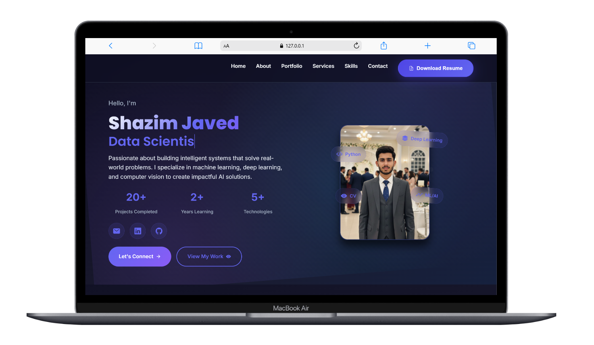
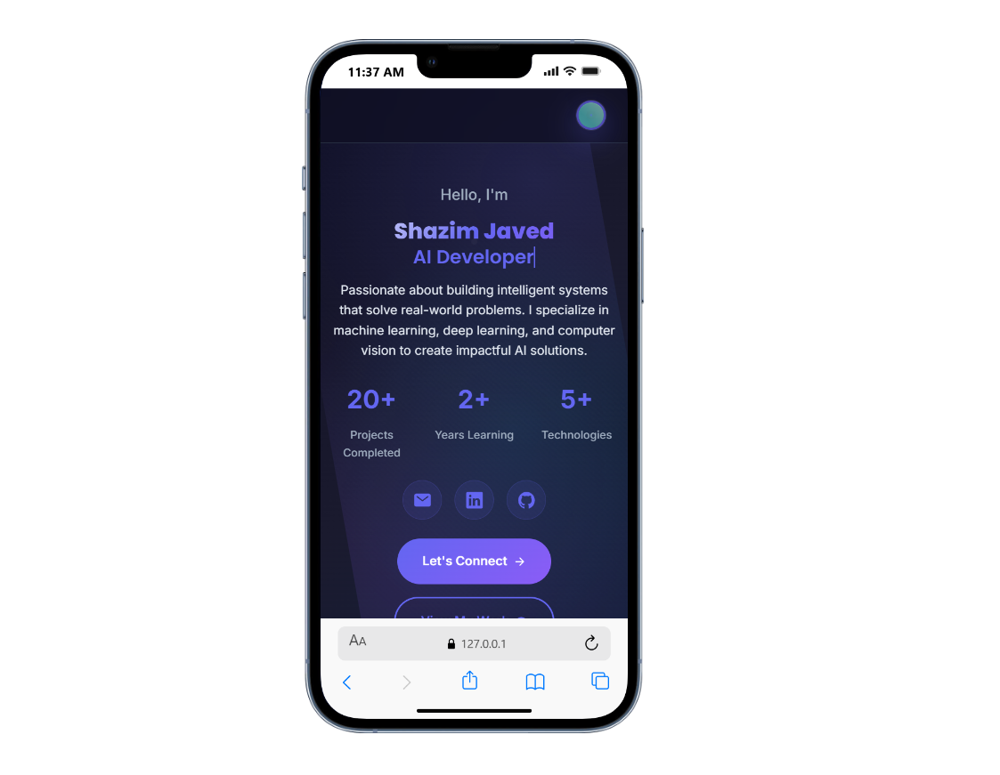

# 🚀 **Shazim Javed - AI/ML Portfolio**

<div align="center">


**A stunning dark-themed portfolio showcasing AI/ML expertise with modern design and smooth animations**

[🌐 **Live Demo**](https://shazim.online) • [📧 **Contact**](mailto:shazimjaved448@gmail.com) • [📄 **Resume**](assets/Resume.pdf)

</div>

---

## ✨ **Features**

### 🎨 **Modern Design**
- **Dark Theme** with elegant color palette
- **Glassmorphism** effects and gradients
- **Smooth animations** and hover effects
- **Responsive design** for all devices
- **Professional typography** and spacing

### 🚀 **Functionality**
- **Interactive navigation** with smooth scrolling
- **Contact form** with EmailJS integration
- **Certificate showcase** with modal viewing
- **Portfolio projects** with hover effects
- **Mobile-optimized** hamburger menu
- **Resume download** functionality

### 📱 **Responsive Design**
- **Mobile-first** approach
- **Tablet optimization**
- **Desktop enhancement**
- **Cross-browser compatibility**

---

## 🛠️ **Technologies Used**

<div align="center">

### **Frontend Technologies**


### **Services & APIs**


</div>

---

## 🎯 **Skills & Expertise**

<div align="center">

### **🤖 AI/ML Technologies**
`Python` `TensorFlow` `Scikit-learn` `Pandas` `NumPy` `Matplotlib` `Seaborn`

### **💻 Web Development**
`HTML5` `CSS3` `JavaScript` `Responsive Design` `Git` `GitHub`

### **📊 Data Science**
`Data Analysis` `Machine Learning` `Deep Learning` `Data Visualization` `Statistical Modeling`

### **🛠️ Tools & Frameworks**
`Jupyter Notebook` `VS Code` `Git` `EmailJS` `Ionicons` `Glassmorphism`

</div>

---

## 📁 **Project Structure**

```
portfolio/
├── 📄 index.html              # Main portfolio page
├── 📄 certificates.html       # Certificates showcase
├── 🎨 favicon.svg            # Site icon
├── 📁 assets/
│   ├── 📁 css/
│   │   └── 🎨 style.css      # All styling & animations
│   ├── 📁 js/
│   │   └── ⚡ script.js      # All functionality
│   ├── 📁 images/            # Portfolio images
│   └── 📄 Resume.pdf         # Resume file
└── 📖 README.md              # This file
```

## 📱 **Screenshots**

<div align="center">

### **Desktop View**


### **Mobile View**


</div>

---

## 🌟 **Key Features Showcase**

### **🎨 Modern Design Elements**
- **Glassmorphism Effects** - Frosted glass backgrounds
- **Gradient Animations** - Smooth color transitions
- **Hover Effects** - Interactive card animations
- **Smooth Scrolling** - Seamless navigation

### **📱 Mobile Optimization**
- **Responsive Grid** - Adapts to all screen sizes
- **Touch-Friendly** - Optimized for mobile interaction
- **Fast Loading** - Optimized images and code
- **Cross-Browser** - Works on all modern browsers

### **⚡ Performance Features**
- **Lazy Loading** - Images load as needed
- **Minified CSS** - Optimized stylesheets
- **Efficient JavaScript** - Clean, fast code
- **SEO Optimized** - Proper meta tags and structure

---

## 📄 **License**

This project is licensed under the **MIT License** - see the [LICENSE](LICENSE) file for details.

---

## 📞 **Contact**

<div align="center">

**Shazim Javed** - AI/ML Developer

[](mailto:shazimjaved448@gmail.com)
[](https://linkedin.com/in/shazimjaved)
[](https://github.com/shazimjaved)

**Phone:** +92 327 7228848

</div>

---

<div align="center">

### **⭐ Star this repository if you found it helpful!**

**Made with ❤️ by [Shazim Javed](https://github.com/shazimjaved)**


</div>
